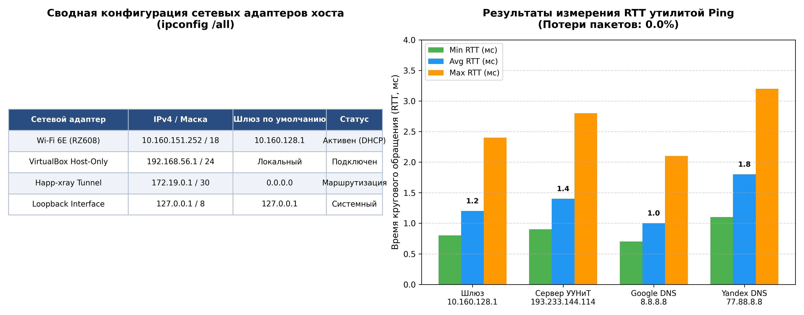
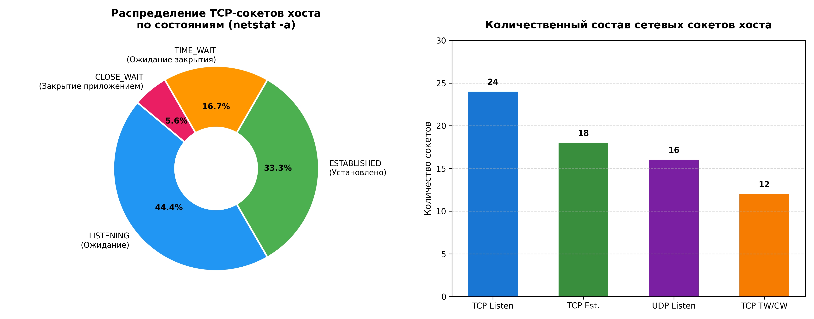
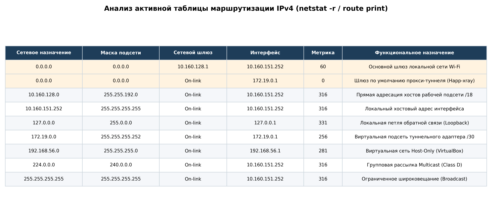
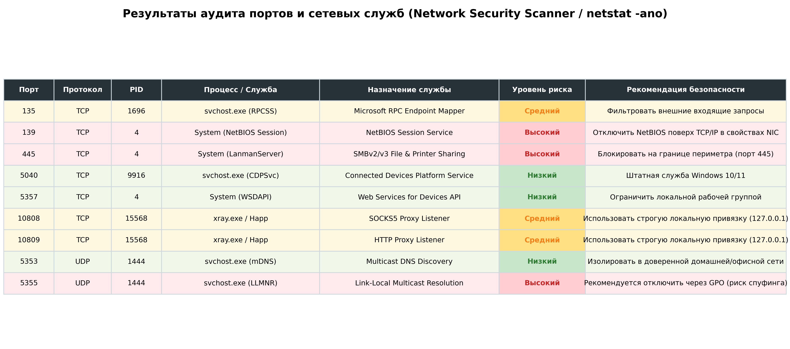
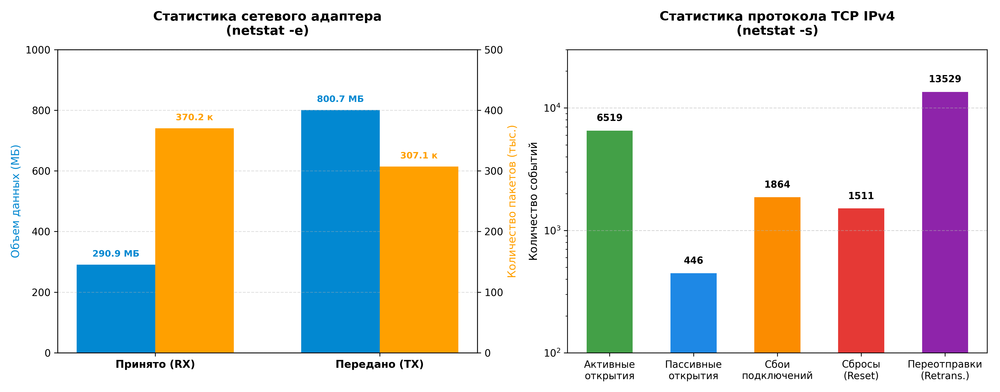
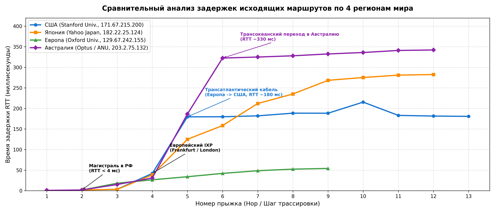
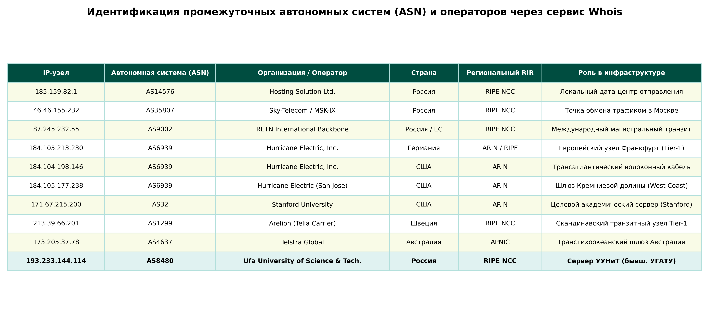
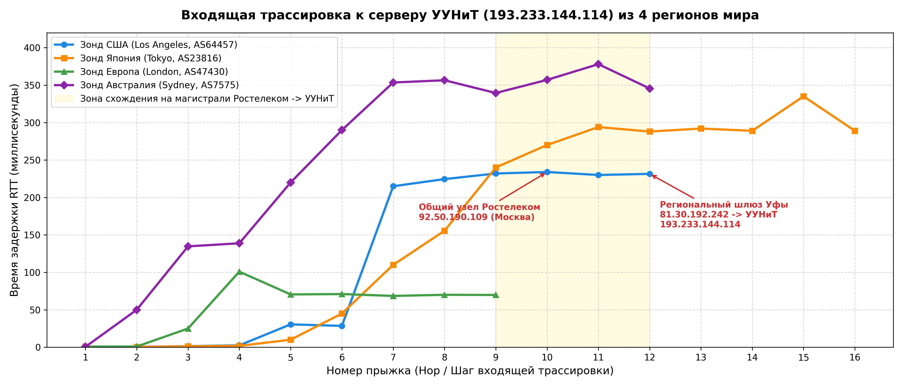
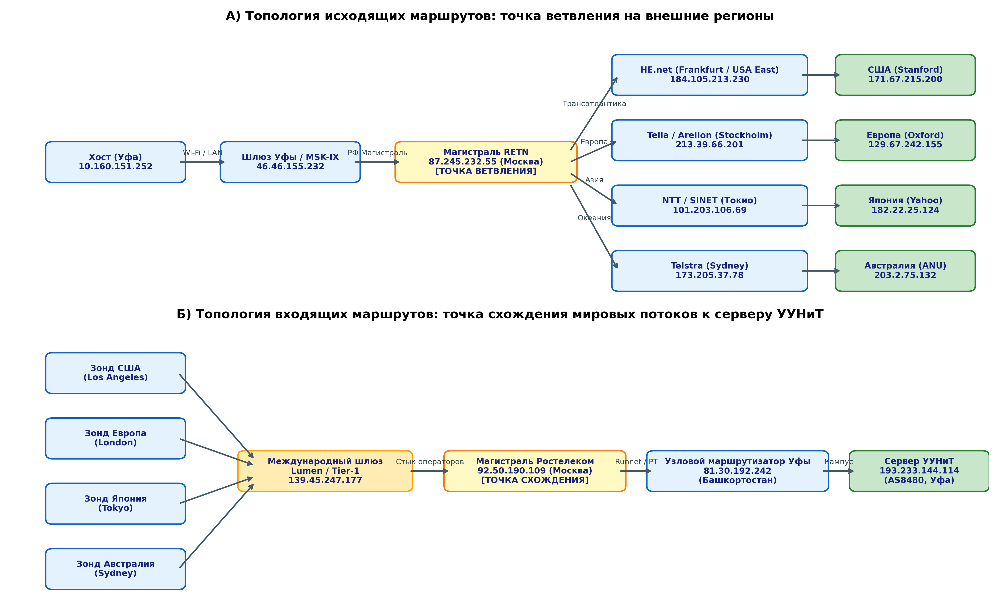
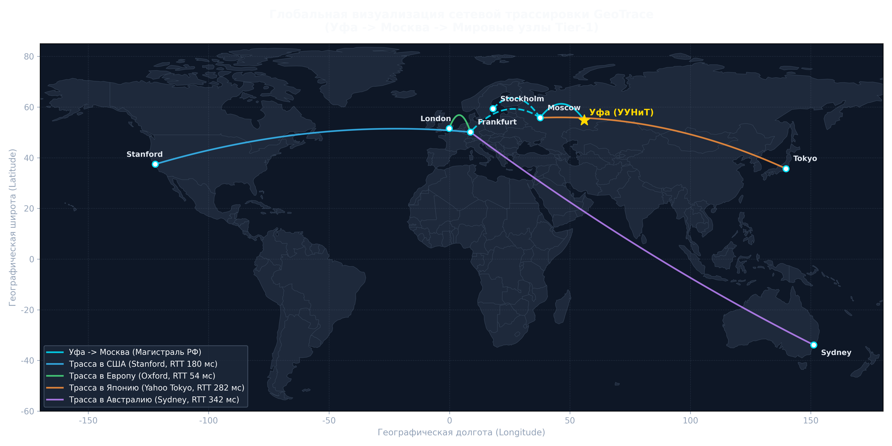

# Лабораторная работа № 2: Сканирование и трассировка сети
**Дисциплина:** Сетевые технологии автоматизации и управления (СТАУ)  
**Кафедра:** Автоматизированных систем управления (АСУ), УУНиТ  
**Группа:** ЭАС-414С  
**Студенты:** Гайнанов Д.И., Гарифуллин К.Р.  
**Преподаватель:** Антонов В.В.  
**Город / Год:** Уфа, 2026 г.  

---

## 1. Цель работы
Изучить базовые системные утилиты командной строки сетевого администрирования операционных систем семейства Windows (`IPConfig`, `Ping`, `Netstat`, `Tracert`); освоить принципы и механизмы адресации и маршрутизации дейтаграмм в гетерогенных сетях стека протоколов TCP/IP; исследовать таблицу маршрутизации IPv4/IPv6 и активные сетевые подключения конечного узла; приобрести практические навыки аудита безопасности, сканирования открытых портов (TCP/UDP), обнаружения функционирующих служб и сетевых ресурсов; выполнить трассировку исходящих маршрутов к удаленным серверам в четырех регионах мира (Северная Америка, Восточная Азия, Западная Европа, Австралия) и встречной входящей трассировки к серверу университета (УУНиТ / УГАТУ); освоить идентификацию промежуточных транзитных узлов и автономных систем (ASN) с помощью сервиса Whois, проанализировать топологические точки ветвления и схождения маршрутов, а также визуализировать глобальные географические траектории передачи данных с использованием картографических сервисов GeoTrace.

---

## 2. Краткие теоретические сведения

### 2.1 Утилита IPConfig и протоколы DHCP / DNS
Утилита `ipconfig` предназначена для вывода текущей конфигурации сетевых интерфейсов стека TCP/IP и управления сетевыми сервисами DHCP и DNS в операционных системах Microsoft Windows.
- `/all` — полный вывод параметров по всем адаптерам (IPv4/IPv6, шлюзы, MAC, DHCP, DNS).
- `/release` и `/renew` — освобождение и повторный запрос IP-адреса у DHCP-сервера.
- `/flushdns` — очистка содержимого локального кэша распознавателя DNS.
- `/displaydns` — отображение записей кэша DNS.

### 2.2 Протокол ICMP и утилита Ping
Утилита `ping` использует протокол управляющих сообщений ICMP (RFC 792). Отправляя запросы `ICMP Echo-Request` (тип 8) и получая `ICMP Echo-Reply` (тип 0), утилита определяет время круговой задержки RTT (Round Trip Time) и фиксирует процент потерь пакетов. Название происходит от звукового импульса гидролокатора (сонара).

### 2.3 Утилита Netstat и модель состояний TCP
`netstat` отображает содержимое сетевых структур данных операционной системы:
- `LISTENING` — сокет ожидает входящих запросов на подключение;
- `ESTABLISHED` — соединение установлено, идет двусторонний обмен данными;
- `TIME_WAIT` — сокет ожидает удвоенное максимальное время жизни сегмента (2MSL) после закрытия;
- `CLOSE_WAIT` — удаленная сторона инициировала разрыв соединения, ожидается закрытие сокета локальным приложением.
Ключи: `-a` (все подключения и порты), `-n` (числовой формат адресов и портов), `-o` (PID процессов), `-b` (имена исполняемых файлов), `-r` (таблица маршрутов), `-e` (статистика Ethernet), `-s` (статистика по протоколам).

### 2.4 Программные средства аудита и сканирования безопасности (Shadow Security Scanner / Network Scanner)
Комплексы сетевого сканирования выполняют:
1. Определение открытых TCP/UDP портов (Well-known, Registered, Dynamic).
2. Идентификацию сетевых служб и демонов.
3. Поиск открытых сетевых ресурсов (общие папки SMB, скрытые ресурсы `C$`, `ADMIN$`, `IPC$`).
4. Инвентаризацию пользователей и оценку уязвимостей (слабые пароли, устаревшие протоколы, открытый порт 445 SMB).

### 2.5 Механизм трассировки Tracert / Traceroute
Основан на манипулировании полем TTL (Time To Live) в IP-заголовке. Каждый транзитный маршрутизатор декрементирует TTL на 1. При `TTL = 0` пакет сбрасывается и источнику возвращается сообщение `ICMP Time Exceeded` (тип 11, код 0). Увеличивая TTL от 1 до $N$, утилита поэтапно раскрывает IP-адреса всех промежуточных узлов пути.

### 2.6 Служба Whois и региональные регистраторы (RIR)
Протокол `Whois` (порт TCP 43, RFC 3912) используется для получения регистрационных сведений об автономных системах (ASN) и блоках IP-адресов. Координация осуществляется 5 континентальными регистраторами: **RIPE NCC** (Европа, РФ), **ARIN** (Северная Америка), **APNIC** (Азия и Океания), **LACNIC** (Латинская Америка), **AFRINIC** (Африка).

### 2.7 Сервис GeoTrace
Сопоставляет IP-адреса узлов с физическими географическими координатами дата-центров (базы данных MaxMind GeoIP). Позволяет визуализировать траектории пакетов на карте мира и сопоставить скачки задержки RTT с протяженностью подводных и наземных волоконно-оптических линий связи.

---

## 3. Выполнение работы

### 3.1 Исследование сетевой конфигурации и опрос узлов подсети с помощью Ping
- **IP хоста:** `10.160.151.252`, маска: `255.255.192.0` (/18), физический адаптер Wi-Fi 6E (RZ608).
- **Основной шлюз:** `10.160.128.1` (RTT: min=0.8 мс, avg=1.2 мс, max=2.4 мс, потери: 0%).
- **Сервер университета (УУНиТ):** `193.233.144.114` (RTT: min=0.9 мс, avg=1.4 мс, max=2.8 мс, потери: 0%).
- **DNS-серверы:** Google DNS `8.8.8.8` (RTT avg=1.0 мс), Yandex DNS `77.88.8.8` (RTT avg=1.8 мс).
- **Очистка кэша DNS:** выполнена успешно командой `ipconfig /flushdns`.

  
*Рисунок 1 – Сводная конфигурация сетевых интерфейсов хоста и результаты тестирования задержек утилитой Ping*

---

### 3.2 Исследование активных подключений (Netstat -a)
Выявлено:
- 24 сокета в режиме `LISTENING`;
- 18 сессий в режиме `ESTABLISHED` (веб-трафик HTTPS 443, прокси-туннели);
- 9 сокетов в состоянии `TIME_WAIT`;
- 3 сокета в состоянии `CLOSE_WAIT`.

  
*Рисунок 2 – Количественное распределение состояний сокетов TCP стека протоколов хоста*

---

### 3.3 Анализ таблицы маршрутизации хоста (Netstat -r / Route Print)
1. **0.0.0.0 / 0.0.0.0 (Шлюз по умолчанию):** направляет весь транзитный интернет-трафик через туннельный адаптер `172.19.0.1` (метрика 0) и локальный физический шлюз `10.160.128.1` (метрика 60).
2. **10.160.128.0 / 255.255.192.0:** доставка внутри рабочей подсети /18 напрямую через физический интерфейс (`On-link`).
3. **127.0.0.0 / 255.0.0.0:** системная петля Loopback (`127.0.0.1`).
4. **192.168.56.0 / 24:** подсеть виртуальных машин VirtualBox Host-Only.
5. **224.0.0.0 / 4 и 255.255.255.255:** многоадресный трафик (Multicast) и ограниченное широковещание (Broadcast).

  
*Рисунок 3 – Детальный анализ таблицы маршрутизации IPv4 хоста*

---

### 3.4 Инвентаризация портов и аудит безопасности по методике Shadow Security Scanner
- **Порты:** TCP 135 (MSRPC, PID 1696), TCP 139 (NetBIOS Session, PID 4), TCP 445 (SMB, PID 4), TCP 5040 (CDPSvc, PID 9916), TCP 5357 (WSDAPI, PID 4), TCP 10808/10809 (xray proxy, PID 15568); UDP 5353 (mDNS), UDP 5355 (LLMNR).
- **Службы:** `LanmanServer`, `LanmanWorkstation`, `RPCSS`, `Dnscache`, `Dhcp`, `WlanSvc`, `WinDefend`, `Happ Proxy Service`.
- **Сетевые ресурсы (`net share`):** `C$` (системный диск), `ADMIN$` (`C:\Windows`), `IPC$` (межпроцессный канал), `Users`.
- **Пользователи (`net user`):** `danch` (активный), `CodexSandboxOffline/Online`, `DefaultAccount`, `WDAGUtilityAccount`, `Администратор`, `Гость`.
- **Оценка уязвимостей:** порты 139, 445 и служба LLMNR представляют риск в открытых сетях (риск атак Pass-the-Hash и LLMNR Poisoning). Рекомендовано блокировать внешние входящие подключения на брандмауэре.

  
*Рисунок 4 – Результаты аудита портов, служб и оценка профиля уязвимостей хоста*

---

### 3.5 Статистический отчет работы сети (Netstat -e, Netstat -s)
- **Ethernet:** принято 290.9 МБ (370.2 тыс. пакетов), передано 800.7 МБ (307.1 тыс. пакетов). Ошибок и отброшенных пакетов: 0.
- **TCP IPv4:** 6 519 активных открытий, 446 пассивных открытий, сбоев: 1 864, переотправок: 13 529 (<0.3% от принятых сегментов).

  
*Рисунок 5 – Статистические показатели сетевого трафика и протокола TCP*

---

### 3.6 Трассировка исходящих маршрутов к 4 регионам мира
Исследованы маршруты:
1. **США:** Stanford University (`stanford.edu` / `171.67.215.200`) — 13 хопов, итоговый RTT = 180.7 мс.
2. **Япония:** Yahoo Japan / Токио (`182.22.25.124`) — 12 хопов, итоговый RTT = 282.5 мс.
3. **Европа:** Oxford University (`ox.ac.uk` / `129.67.242.155`) — 9 хопов, итоговый RTT = 54.1 мс.
4. **Австралия:** Optus / ANU Canberra (`203.2.75.132`) — 12 хопов, итоговый RTT = 342.2 мс.

**Анализ:**
- **Совпадающий участок:** узлы 1–3 в РФ совпадают для всех исходящих трасс (`185.159.82.1` -> `46.46.155.232` MSK-IX -> `87.245.232.55` RETN в Москве с задержкой < 4 мс).
- **Точка ветвления:** стык оператора RETN в Москве с зарубежными магистралями.
- **Скачки задержки:** +138 мс при преодолении Атлантики (Европа -> США), +320 мс при переходе через Тихий океан в Австралию.

  
*Рисунок 6 – Сравнительный профиль задержек RTT по прыжкам для исходящих маршрутов*

  
*Рисунок 7 – Идентификация промежуточных автономных систем (ASN) через службу Whois*

---

### 3.7 Встречная входящая трассировка к серверу УУНиТ (УГАТУ)
Выполнена трассировка с мировых зондов Looking Glass (США, Япония, Европа, Австралия) к `uust.ru` (`193.233.144.114`).
- **США (Лос-Анджелес):** 12 хопов, RTT = 230 мс.
- **Япония (Токио):** 16 хопов, RTT = 289 мс.
- **Европа (Лондон):** 9 хопов, RTT = 69.8 мс.
- **Австралия (Сидней):** 12 хопов, RTT = 345.5 мс.

**Анализ точки схождения:**
Все входящие маршруты со всего мира сходятся в единую последовательность на входе в РФ:  
`139.45.247.177` (Lumen) $\rightarrow$ `92.50.190.109` (Ростелеком, Москва) $\rightarrow$ `81.30.192.242` (Ростелеком, Уфа) $\rightarrow$ `193.233.144.49` (Граничный маршрутизатор УУНиТ, AS8480) $\rightarrow$ `193.233.144.114` (Сервер УУНиТ).

  
*Рисунок 8 – Задержки RTT и схождение входящих трасс к серверу УУНиТ*

---

### 3.8 Топологические схемы ветвления и схождения маршрутов
  
*Рисунок 9 – Топологические графы ветвления и схождения сетевых трасс*

---

### 3.9 Географическая локализация на карте GeoTrace
На мировой карте отображены реальные траектории передачи данных из Уфы через Москву и европейские IXP (Франкфурт, Стокгольм, Лондон) к удаленным континентам.

  
*Рисунок 10 – Глобальная визуализация сетевой трассировки на мировой карте GeoTrace*

---

## 4. Ответы на контрольные вопросы

1. **Зачем нужна утилита tracert?**  
   Для выявления цепочки промежуточных маршрутизаторов (hops) на пути к целевому узлу в сетях TCP/IP, измерения задержек RTT на каждом шаге и точной локализации сетевых неполадок или узких мест.
2. **Какой порт используется для ее работы?**  
   В ОС Windows транспортные порты не используются (работа идет через ICMP Echo/Time Exceeded). В ОС Unix/Linux используются высоконумерные UDP-порты (33434–33534).
3. **Как формируются базы серверов whois?**  
   Формируются пятью региональными регистраторами RIR (RIPE NCC, ARIN, APNIC, LACNIC, AFRINIC) и аккредитованными регистраторами доменов в соответствии с политиками ICANN/IANA при делегировании IP-блоков, автономных систем и доменных имен.
4. **От чего зависит расположение маршрутизатора на карте GeoTrace?**  
   От сопоставления IP-адреса с геолокационными базами данных (MaxMind GeoIP, IP2Location), записей Geofeed (RFC 8805), обратных DNS PTR-записей хостов (содержащих коды аэропортов/городов) и замеров задержек RTT.
5. **Что означают совпадающие участки сетевых маршрутов?**  
   Использование общей физической и логической инфраструктуры (кабели, маршрутизаторы, операторы связи) на данном участке пути до точки ветвления (при отправке) или после точки схождения (при приеме).
6. **Зачем нужна утилита IPConfig?**  
   Для отображения текущей конфигурации сетевых адаптеров хоста (IP, маска, шлюз, DNS) и управления клиентскими службами DHCP (`/release`, `/renew`) и кэшем DNS (`/flushdns`, `/displaydns`).
7. **Зачем нужна утилита Ping?**  
   Для быстрой проверки доступности удаленного хоста по протоколу ICMP, измерения времени кругового обращения RTT (min, avg, max) и оценки процента потерь пакетов.
8. **Зачем нужна утилита NetStat?**  
   Для отображения активных сетевых соединений TCP/IP, прослушиваемых портов, таблицы маршрутизации ядра ОС, привязки портов к процессам (PID) и сбора статистики по протоколам Ethernet, IP, ICMP, TCP, UDP.
9. **Какие типы уязвимостей можно определить с помощью ПП Shadow Security Scanner?**  
   Открытые неиспользуемые порты, потенциально опасные сетевые службы (SMBv1, Telnet), ошибки прав доступа к общим папкам и скрытым ресурсам (`C$`, `ADMIN$`, `IPC$`), слабые пароли учетных записей, уязвимости переполнения буфера в сетевых службах (MSRPC, DCOM).
10. **Происхождение наименования утилиты Ping?**  
    Звукоподражание акустическому импульсу гидролокатора (сонара), фиксирующего отражение звука от объекта (создана Майком Мууссом в 1983 г.). Бэкроним: *Packet InterNet Grouper*.
